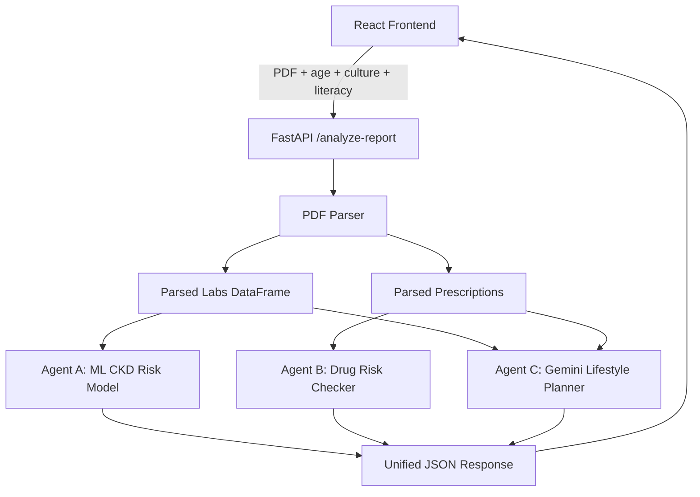

# NephroNet-CKD

NephroNet-CKD is a full-stack chronic kidney disease report-analysis prototype. It accepts a patient medical report PDF, parses key lab and prescription values, runs a multi-agent analysis pipeline, and presents CKD risk, medication safety notes, and personalized food/lifestyle guidance through a modern React interface.

> Important: NephroNet is an educational and decision-support prototype. It is not a medical device, does not diagnose disease, and must not replace advice from a qualified healthcare professional.

## Table of Contents

- [Overview](#overview)
- [Core Features](#core-features)
- [Architecture](#architecture)
- [Agent System](#agent-system)
- [Data Flow](#data-flow)
- [Project Structure](#project-structure)
- [Setup](#setup)
- [Running the App](#running-the-app)
- [Environment Variables](#environment-variables)
- [API Reference](#api-reference)
- [Machine Learning Details](#machine-learning-details)
- [Gemini Integration](#gemini-integration)
- [Frontend Experience](#frontend-experience)
- [Known Limitations](#known-limitations)
- [Troubleshooting](#troubleshooting)
- [Development Notes](#development-notes)

## Overview

The project is organized around three specialized agents:

1. **Agent A - CKD Risk Assessor**
   - Parses patient lab values from uploaded reports.
   - Uses a trained machine learning model based on `data/kidney_disease.csv`.
   - Produces a risk score, risk label, CKD probability, confidence, and reasoning.

2. **Agent B - Drug Safety Checker**
   - Reads prescription names extracted from the PDF.
   - Checks whether detected medicines have kidney-related risk.
   - Returns risk level, notes, and safer alternatives when available.

3. **Agent C - Patient Educator**
   - Uses Gemini API when configured.
   - Consumes parsed report values, user age, cultural/ethnic context, literacy level, risk level, and prescriptions.
   - Generates a structured food prescription and lifestyle plan.
   - Falls back to local rule-based guidance if Gemini is unavailable.

The frontend presents these outputs as a guided report analysis experience with upload controls, profile inputs, full-screen Agent C recommendations, login/signup screens, account page, and a CKD assistant chatbot.

## Core Features

- PDF upload and parsing for kidney-related lab values.
- Medication extraction from report text.
- Machine-learning-based CKD risk prediction.
- Drug nephrotoxicity and alternative medicine lookup.
- Gemini-powered personalized food and lifestyle guidance.
- Health-literacy-aware output.
- Cultural/ethnic food guidance.
- Modern Vite/React frontend with animations.
- Account/login UI prototype.
- Three.js welcome character on the login screen.
- Downloadable text report.
- Local fallback behavior when Gemini is not configured.

## Architecture



## Agent System

### Agent A: CKD Risk Assessor

File: `agents/agent_a/agent_a.py`

Agent A is responsible for the CKD risk assessment. Earlier versions used fixed hardcoded thresholds. The current version trains and loads a scikit-learn machine learning pipeline from the CKD dataset.

Agent A performs the following:

- Loads `data/kidney_disease.csv`.
- Cleans numeric and categorical fields.
- Trains a `RandomForestClassifier`.
- Caches the trained model in `models/agent_a_ckd_model.pkl`.
- Accepts parsed report values from `temp_labs.csv`.
- Predicts CKD probability.
- Maps probability to risk:
  - `Low`
  - `Mild`
  - `Moderate`
  - `High`
- Produces readable reasoning from abnormal parsed values such as:
  - high serum creatinine
  - high blood pressure
  - elevated albumin
  - high blood glucose
  - low hemoglobin

Agent A output includes:

```json
{
  "structured": {
    "score": 3,
    "risk_level": "High",
    "probability": 0.9949,
    "confidence": 0.9949,
    "reasons": ["serum creatinine is elevated at 1.9 mg/dL"],
    "model_accuracy": 1.0
  },
  "narrative": "CKD Risk Assessment Results..."
}
```

### Agent B: Drug Safety Checker

Files:

- `agents/agent_b/agent_b.py`
- `models/drug_database.csv`

Agent B checks medicines extracted from the PDF against the drug risk database.

It returns:

- drug name
- risk level
- clinical notes
- safer alternative when available

Agent B is mounted under:

```text
/agent-b
```

Inside the unified report flow, Agent B runs automatically after the PDF parser extracts prescription names.

### Agent C: Patient Educator

File: `agents/agent_c/agent_c.py`

Agent C generates personalized food and lifestyle guidance.

It receives:

- parsed lab values
- detected prescriptions
- age
- cultural/ethnic background
- literacy level
- Agent A risk level

When `GEMINI_API_KEY` is configured, Agent C sends a structured prompt to Gemini and asks for strict JSON in this shape:

```json
{
  "food_prescription": {
    "avoid": ["foods or drinks to avoid/limit"],
    "add": ["foods or drinks to add/prefer"]
  },
  "lifestyle_changes": ["practical lifestyle changes"],
  "personalization_notes": ["why these recommendations were chosen"],
  "safety_note": "medical safety reminder"
}
```

The frontend renders Agent C as a full-screen prescription card with:

- things to avoid or limit
- things to add to diet
- lifestyle changes
- notes explaining how the uploaded report influenced the guidance

If Gemini fails or no API key is set, Agent C falls back to a local rule-based personalized plan.

## Data Flow

1. User uploads a medical report PDF in the frontend.
2. User enters:
   - age
   - cultural background / ethnicity
   - literacy level
3. Frontend sends a multipart request to `/analyze-report`.
4. Backend saves the uploaded PDF locally.
5. `utils/pdf_parser.py` extracts:
   - serum creatinine
   - blood pressure
   - albumin
   - blood glucose
   - hemoglobin
   - prescriptions
6. Agent A predicts CKD risk using ML.
7. Agent B checks prescriptions for kidney-related drug risk.
8. Agent C generates personalized food and lifestyle guidance.
9. Backend returns all agent outputs to the frontend.
10. Frontend renders results and allows report download.

## Project Structure

```text
NephroNet-CKD/
├── agents/
│   ├── agent_a/
│   │   └── agent_a.py
│   ├── agent_b/
│   │   └── agent_b.py
│   └── agent_c/
│       └── agent_c.py
├── data/
│   ├── kidney_disease.csv
│   └── nephrotoxic_drugs.csv
├── frontend/
│   ├── public/
│   └── src/
│       ├── App.jsx
│       ├── api.js
│       ├── components/
│       └── index.css
├── models/
│   ├── agent_a_basic_model.pkl
│   ├── agent_a_ckd_model.pkl
│   ├── agent_b_basic_model.pkl
│   └── drug_database.csv
├── utils/
│   ├── ai_helper.py
│   └── pdf_parser.py
├── main.py
├── requirements.txt
└── README.md
```

## Setup

### Prerequisites

- Python 3.10+
- Node.js 18+
- npm
- Git
- Gemini API key for Agent C personalization

### Backend Setup

From the project root:

```powershell
cd D:\NephroNet-CKD
python -m venv .venv
.\.venv\Scripts\Activate.ps1
pip install -r requirements.txt
```

### Frontend Setup

```powershell
cd D:\NephroNet-CKD\frontend
npm install
```

## Running the App

Run backend and frontend in separate terminals.

### Terminal 1: Backend

```powershell
cd D:\NephroNet-CKD
$env:GEMINI_API_KEY="your_gemini_api_key_here"
python main.py
```

Backend URL:

```text
http://127.0.0.1:8000
```

### Terminal 2: Frontend

```powershell
cd D:\NephroNet-CKD\frontend
npm run dev
```

Frontend URL:

```text
http://localhost:5173
```

## Environment Variables

### `GEMINI_API_KEY`

Required for Gemini-powered Agent C output.

```powershell
$env:GEMINI_API_KEY="your_gemini_api_key_here"
```

### `GEMINI_MODEL`

Optional. Defaults to:

```text
gemini-2.5-flash
```

Override if needed:

```powershell
$env:GEMINI_MODEL="gemini-2.5-flash"
```

## API Reference

### Health Check

```http
GET /ping
```

Response:

```json
{
  "message": "pong"
}
```

### Analyze Report

```http
POST /analyze-report
```

Content type:

```text
multipart/form-data
```

Fields:

| Field | Type | Description |
|---|---|---|
| `file` | PDF | Medical report PDF |
| `age` | integer | Patient age |
| `culture` | string | Cultural/ethnic background |
| `literacy` | string | `basic`, `moderate`, or `advanced` |

Response shape:

```json
{
  "AgentA": {
    "risk": [3],
    "feedback": ["CKD Risk Assessment Results..."]
  },
  "AgentB": {
    "drug_results": []
  },
  "AgentC": {
    "handout": "Food Prescription...",
    "food_prescription": {
      "avoid": [],
      "add": []
    },
    "lifestyle_changes": [],
    "personalization_notes": [],
    "safety_note": ""
  }
}
```

## Machine Learning Details

Agent A uses `data/kidney_disease.csv`, a labeled CKD dataset with 400 rows and 26 columns.

Features include:

- age
- blood pressure
- specific gravity
- albumin
- sugar
- blood glucose
- blood urea
- serum creatinine
- sodium
- potassium
- hemoglobin
- packed cell volume
- white blood cell count
- red blood cell count
- hypertension
- diabetes
- coronary artery disease
- appetite
- pedal edema
- anemia

Model pipeline:

```text
numeric features -> median imputation -> standard scaling
categorical features -> most frequent imputation -> one-hot encoding
combined features -> random forest classifier
```

The model is cached at:

```text
models/agent_a_ckd_model.pkl
```

To retrain manually:

```powershell
python -c "from agents.agent_a.agent_a import train_agent_a_model; train_agent_a_model(force=True)"
```

## Gemini Integration

Agent C calls Gemini through the Python SDK when `GEMINI_API_KEY` is available.

Gemini receives structured patient context, not raw PDF files:

- parsed labs
- prescriptions
- age
- cultural background
- literacy level
- CKD risk score

This keeps the prompt focused and makes the output more predictable.

If Gemini returns malformed output, fails, or is unavailable, Agent C uses the local fallback planner.

## Frontend Experience

Frontend stack:

- React
- Vite
- Framer Motion
- Lucide React icons
- Three.js
- Tailwind/PostCSS setup

Main frontend sections:

- animated hero carousel
- CKD education section
- report upload workflow
- results view
- Agent C full-screen food/lifestyle prescription
- team section
- feedback footer
- chatbot
- login/signup screens
- account page

Account routes:

```text
/#login
/#signup
/#account
```

## Known Limitations

- The PDF parser currently uses regex patterns and may miss values if reports use unusual wording or formatting.
- Agent A is trained on a small public CKD dataset. It is useful for demonstration but not clinical validation.
- Agent B depends on the included drug database and only detects medicines covered by parser patterns.
- Agent C output depends on Gemini quality and the parsed report values.
- The login/account system is a UI prototype and does not persist real authenticated users.
- Uploaded PDFs are saved locally by the backend during analysis.
- The app should not be deployed with `allow_origins=["*"]` in production.

## Troubleshooting

### Gemini is not being used

Check that the backend terminal has the key set:

```powershell
$env:GEMINI_API_KEY
```

Restart backend after setting the key.

### Agent C falls back to local output

Possible causes:

- missing API key
- invalid Gemini model name
- Gemini API quota issue
- malformed Gemini response
- network failure

### Frontend cannot analyze report

Make sure backend is running:

```text
http://127.0.0.1:8000/ping
```

### New dependencies are missing

Run:

```powershell
pip install -r requirements.txt
cd frontend
npm install
```

### Agent A model seems stale

Force retrain:

```powershell
python -c "from agents.agent_a.agent_a import train_agent_a_model; train_agent_a_model(force=True)"
```

## Development Notes

- Keep generated PDFs out of git.
- Keep API keys out of git.
- Do not commit `.env`.
- Use `temp_labs.csv` only as a local generated artifact.
- For production, replace local file saving with safer upload handling.
- For production, add authentication, persistent accounts, secure storage, better validation, and clinical review.

## Disclaimer

NephroNet-CKD is a student-built software prototype for education, research, and demonstration. It does not provide medical diagnosis or treatment. Always consult qualified healthcare professionals for medical decisions.
