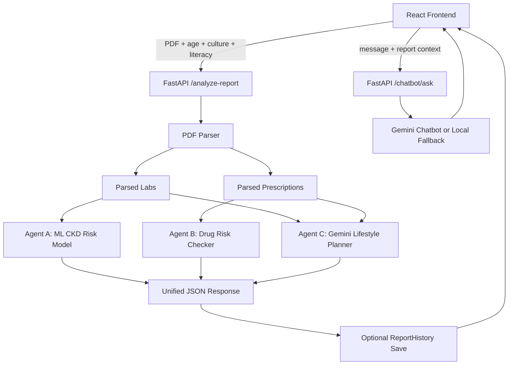

# NephroNet-CKD

NephroNet-CKD is a full-stack chronic kidney disease report-analysis prototype. It accepts a medical report PDF, parses kidney-related lab and prescription values, runs a multi-agent analysis pipeline, and presents CKD risk, medication safety notes, personalized food/lifestyle guidance, account history, and a report-aware CKD chatbot through a React interface.

> Important: NephroNet is an educational and decision-support prototype. It is not a medical device, does not diagnose disease, and must not replace advice from a qualified healthcare professional.

## Core Features

- PDF upload and parsing for kidney-related lab values.
- Medication extraction from report text.
- Machine-learning-based CKD risk prediction.
- Drug nephrotoxicity and safer-alternative lookup.
- Gemini-powered personalized food and lifestyle guidance through Agent C.
- Gemini-powered chatbot answers for general CKD education and report-specific follow-up questions.
- Local chatbot fallback for common CKD, diabetes, carbohydrate, diet, testing, treatment, and report-risk questions.
- Health-literacy-aware output.
- Cultural/ethnic food guidance.
- Signup/login with JWT-based sessions.
- Saved report history for logged-in users.
- Downloadable generated NephroNet summary documents.
- Downloadable uploaded PDFs for saved reports.
- Account metrics for latest risk, average risk, highest risk, and risk trend.
- Modern Vite/React frontend with Framer Motion, Lucide icons, and a Three.js login character.
- Gemini model discovery for chatbot responses, with `gemini-2.5-flash` as the preferred local default.
- Local fallback behavior when Gemini is unavailable or not configured.

## Architecture



## Agent System

### Agent A: CKD Risk Assessor

File: `agents/agent_a/agent_a.py`

Agent A uses a scikit-learn machine learning pipeline trained from `data/kidney_disease.csv`. It parses report values from `temp_labs.csv`, predicts CKD probability, maps the probability to `Low`, `Mild`, `Moderate`, or `High`, and returns readable reasoning from abnormal values such as serum creatinine, blood pressure, albumin, blood glucose, and hemoglobin.

### Agent B: Drug Safety Checker

Files:

- `agents/agent_b/agent_b.py`
- `models/drug_database.csv`
- `data/nephrotoxic_drugs.csv`

Agent B checks extracted prescriptions against a kidney-risk medicine database. It returns drug name, RxNorm ID when available, risk level, clinical notes, and safer alternative information when available. It is mounted under `/agent-b` and also runs inside `/analyze-report`.

### Agent C: Patient Educator

File: `agents/agent_c/agent_c.py`

Agent C receives parsed lab values, detected prescriptions, age, cultural/ethnic background, literacy level, and Agent A risk level. When `GEMINI_API_KEY` is configured, it asks Gemini for strict JSON:

```json
{
  "food_prescription": {
    "avoid": ["foods or drinks to avoid/limit"],
    "add": ["foods or drinks to add/prefer"]
  },
  "lifestyle_changes": ["practical lifestyle changes"],
  "personalization_notes": ["why these recommendations were chosen"],
  "safety_note": "medical safety reminder"
}
```

If Gemini fails or is unavailable, Agent C falls back to local rule-based personalized guidance.

### CKD Assistant Chatbot

Files:

- `frontend/src/components/Chatbot.jsx`
- `frontend/src/api.js`
- `main.py`

The chatbot sends messages to `POST /chatbot/ask`. It can answer using Gemini, the current report analysis result passed from the frontend, the latest saved report for a logged-in user, and local fallback rules.

The chatbot response includes diagnostics:

```json
{
  "answer": "Patient-friendly response...",
  "response_source": "gemini",
  "gemini_configured": true,
  "used_report_context": true,
  "report": {
    "filename": "report.pdf",
    "risk_label": "Moderate",
    "risk_score": 2
  }
}
```

`response_source` is `gemini` when Gemini answered and `local` when the rule-based fallback answered.

## Data Flow

1. User uploads a medical report PDF.
2. User enters age, cultural background, and literacy level.
3. Frontend sends a multipart request to `/analyze-report`.
4. Backend saves the uploaded PDF locally.
5. `utils/pdf_parser.py` extracts lab values and prescriptions.
6. Agent A predicts CKD risk.
7. Agent B checks prescriptions for kidney-related risk.
8. Agent C generates personalized food and lifestyle guidance.
9. For logged-in users, backend saves report metadata, parsed values, agent outputs, generated summary text, and the uploaded PDF path.
10. Backend returns all agent outputs plus compact `ReportContext`.
11. Frontend renders results, downloads, and chatbot follow-up support.
12. The chatbot uses the current report context immediately, or the latest saved report after login.

## Project Structure

```text
NephroNet-CKD/
|-- agents/
|   |-- agent_a/
|   |-- agent_b/
|   `-- agent_c/
|-- backend/
|   |-- auth.py
|   |-- database.py
|   |-- main.py
|   `-- models.py
|-- data/
|-- frontend/
|   |-- public/
|   `-- src/
|       |-- App.jsx
|       |-- api.js
|       |-- components/
|       `-- index.css
|-- models/
|-- utils/
|-- main.py
|-- requirements.txt
`-- README.md
```

## Setup

### Prerequisites

- Python 3.10+
- Node.js 18+
- npm
- Git
- Gemini API key for Gemini-powered guidance and chatbot answers

### Backend

```powershell
cd D:\NephroNet-CKD
python -m venv .venv
.\.venv\Scripts\Activate.ps1
pip install -r requirements.txt
```

### Frontend

```powershell
cd D:\NephroNet-CKD\frontend
npm install
```

## Running the App

Run backend and frontend in separate terminals.

### Terminal 1: Backend

```powershell
cd D:\NephroNet-CKD
uvicorn main:app --reload --host 127.0.0.1 --port 8000
```

Backend URL:

```text
http://127.0.0.1:8000
```

### Terminal 2: Frontend

```powershell
cd D:\NephroNet-CKD\frontend
npm run dev
```

Frontend URL:

```text
http://localhost:5173
```

## Environment Variables

The backend loads a local `.env` file from the project root for development:

```env
GEMINI_API_KEY=your_gemini_api_key_here
GEMINI_MODEL=gemini-2.5-flash
```

You can also set values in PowerShell:

```powershell
$env:GEMINI_API_KEY="your_gemini_api_key_here"
$env:GEMINI_MODEL="gemini-2.5-flash"
```

`GEMINI_MODEL` is optional. The chatbot defaults to `gemini-2.5-flash` and also calls Gemini model discovery to try available `generateContent` models if the configured model is unsupported.

## API Reference

### Health Check

```http
GET /ping
```

### Analyze Report

```http
POST /analyze-report
```

Content type: `multipart/form-data`

Fields:

| Field | Type | Description |
|---|---|---|
| `file` | PDF | Medical report PDF |
| `age` | integer | Patient age |
| `culture` | string | Cultural/ethnic background |
| `literacy` | string | `basic`, `moderate`, or `advanced` |

Response shape:

```json
{
  "AgentA": {
    "risk": [2],
    "feedback": ["CKD Risk Assessment Results..."]
  },
  "AgentB": {
    "drug_results": []
  },
  "AgentC": {
    "handout": "Food Prescription...",
    "food_prescription": {
      "avoid": [],
      "add": []
    },
    "lifestyle_changes": [],
    "personalization_notes": [],
    "safety_note": ""
  },
  "ReportContext": {
    "filename": "report.pdf",
    "risk_score": 2,
    "risk_label": "Moderate",
    "lab_values": {},
    "prescriptions": []
  },
  "ReportRecord": null
}
```

If the request includes a valid bearer token, `ReportRecord` contains saved report metadata.

### Ask Chatbot

```http
POST /chatbot/ask
```

Content type: `application/json`

Request:

```json
{
  "message": "What carbohydrates should I avoid?",
  "report_context": {
    "ReportContext": {
      "risk_label": "Moderate",
      "risk_score": 2,
      "lab_values": {
        "sc": 2.1,
        "hemo": 11
      }
    }
  }
}
```

Response:

```json
{
  "answer": "Patient-friendly answer...",
  "response_source": "gemini",
  "gemini_configured": true,
  "used_report_context": true,
  "report": {
    "filename": "report.pdf",
    "risk_label": "Moderate",
    "risk_score": 2
  }
}
```

When `report_context` is omitted, the backend uses the logged-in user's latest saved report if available. If no report context exists, the chatbot can still answer general CKD questions.

### Account and Reports

```http
POST /signup
POST /login
GET /me
GET /account/summary
GET /account/reports
GET /account/reports/{report_id}/document
GET /account/reports/{report_id}/uploaded-report
```

Authenticated report uploads are saved to the local SQLite-backed report history. The account page uses these endpoints to show saved uploads, risk trends, and downloadable report summaries.

## Machine Learning Details

Agent A uses `data/kidney_disease.csv`, a labeled CKD dataset with features such as age, blood pressure, specific gravity, albumin, sugar, blood glucose, blood urea, serum creatinine, sodium, potassium, hemoglobin, hypertension, diabetes, appetite, edema, and anemia.

Model pipeline:

```text
numeric features -> median imputation -> standard scaling
categorical features -> most frequent imputation -> one-hot encoding
combined features -> random forest classifier
```

The model is cached at:

```text
models/agent_a_ckd_model.pkl
```

To retrain manually:

```powershell
python -c "from agents.agent_a.agent_a import train_agent_a_model; train_agent_a_model(force=True)"
```

## Gemini Integration

Agent C and the chatbot call Gemini through the Python SDK when `GEMINI_API_KEY` is available.

Gemini receives structured context, not raw PDF files:

- parsed labs
- prescriptions
- age
- cultural background
- literacy level
- CKD risk score
- current chatbot question

For chatbot answers, the backend returns `response_source` so the frontend/devtools can confirm whether Gemini or the local fallback answered. If a configured Gemini model is unavailable, the backend lists supported models and tries available `generateContent` models.

## Frontend Experience

Frontend stack:

- React
- Vite
- Framer Motion
- Lucide React icons
- Three.js
- Tailwind/PostCSS setup

Main frontend sections:

- animated hero carousel
- CKD education section
- report upload workflow
- results view
- Agent C full-screen food/lifestyle prescription
- report-aware chatbot with Gemini/local response diagnostics
- team section
- feedback footer
- login/signup screens
- account page

Account routes:

```text
/#login
/#signup
/#account
```

## Known Limitations

- The PDF parser currently uses regex patterns and may miss values if reports use unusual wording or formatting.
- Agent A is trained on a small public CKD dataset. It is useful for demonstration but not clinical validation.
- Agent B depends on the included drug database and only detects medicines covered by parser patterns.
- Gemini output depends on prompt quality, model availability, quota, and parsed report values.
- Account data is stored in local SQLite and is intended for development/demo use, not production medical data storage.
- Uploaded PDFs are saved locally by the backend for logged-in report history.
- The app should not be deployed with `allow_origins=["*"]` in production.

## Troubleshooting

### Gemini is not being used

Check the `/chatbot/ask` JSON response:

```json
{
  "response_source": "local",
  "gemini_configured": false
}
```

If `gemini_configured` is false, check that the backend can see the key:

```powershell
$env:GEMINI_API_KEY
```

Restart backend after setting the key or editing `.env`.

If `gemini_configured` is true but `response_source` is still `local`, check the backend logs for model, quota, or network errors. The app defaults to `gemini-2.5-flash` and attempts model discovery if that model is unavailable.

### Frontend cannot analyze report

Make sure backend is running:

```text
http://127.0.0.1:8000/ping
```

### Dependencies are missing

```powershell
pip install -r requirements.txt
cd frontend
npm install
```

### Agent A model seems stale

```powershell
python -c "from agents.agent_a.agent_a import train_agent_a_model; train_agent_a_model(force=True)"
```

## Development Notes

- Keep generated PDFs out of git.
- Keep API keys out of git.
- Do not commit `.env`.
- Use `temp_labs.csv` only as a local generated artifact.
- For production, replace local file saving with safer upload handling.
- For production, add hardened authentication, secure storage, stricter validation, observability, and clinical review.

## Disclaimer

NephroNet-CKD is a student-built software prototype for education, research, and demonstration. It does not provide medical diagnosis or treatment. Always consult qualified healthcare professionals for medical decisions.
